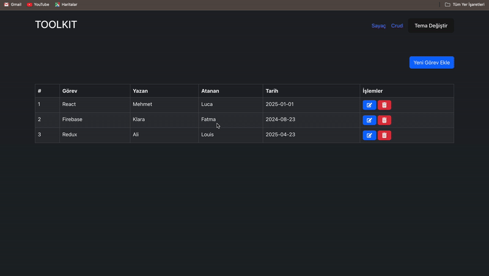

# Toolkit-Crud-App

This project is a Task Management Application where you can perform CRUD (Create, Read, Update, Delete) operations.

 Users can add, delete and edit relative in this web application. There is also a counter page. Users can use the application in two different ways: dark mode and light mode.
 

